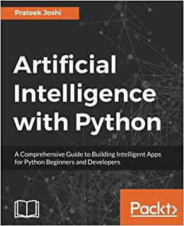

# Artificial Intelligence with Python - Joshi 

  

This repository contains python code in ipynb format and raw data for practice of  "Artificial Intelligence with Python - Joshi".

* Contents
	- Classification and Regression using Supervised Learning
		1. Data preprocessing
		2. Naive Bayes classifier
		3. Support vector machine
		4. Regression
	- Predictive analytics with Ensemble Learning
		1. Decision Tree
		2. Random Forests & Extremely Random Forests
		3. Gird search
		4. Extremely Random Forests regressor
	- Detecting Patterns with Unsupervised Learning
		1. K-Means
		2. Mean Shift
		3. Silhouette score
		4. Gaussian Mixture model
		5. Affinity Propagation model
	- Building Recommendation systems
		1. Training pipepline
		2. K-NN
		3. Similarity score
		4. Collaborative Filtering
	- Logic Programming
	- Heuristic Search techniques
		1. Constraint Satisfaction problems
		2. Simulated Annealing
		3. Greedy search
	- Genetic Algorithms
	- Building Games with AI
		1. Combinatorial search
		2. Minimax algorithms
		3. Alpha-Beta pruning
		4. Negamax algorithms
		5. Tic-Tac-Toe
		6. Hexapawn
	- Natural Language Processing
		1. Tokenizing
		2. Stemming & Lemmatizing
		3. Bag of Words
		4. Sentiment analysis
		5. Latent Dirchlet Allocation
	- Probabilistic Reasoning for Sequential Data
		1. time-series data with Pandas
		2. Hidden Markov model
		3. Conditional Random Field
	- Building a Speech Reconizer
	- Object Detection and Tracking
		1. OpenCV
		2. CAMShift algorithm
		3. Face detection and tracking
	- Artificial Neural Networks
		1. Multi Layer Perceptron
		2. Recurrent Neural Network
		3. Visualizing characters
		4. Optical Character Recognition engine
	- Reinforcement Learning
		1. Reinforcement Learning vs. Supervised Learning
		2. Building a learning agent 
	- Convolutional Neural Network

 